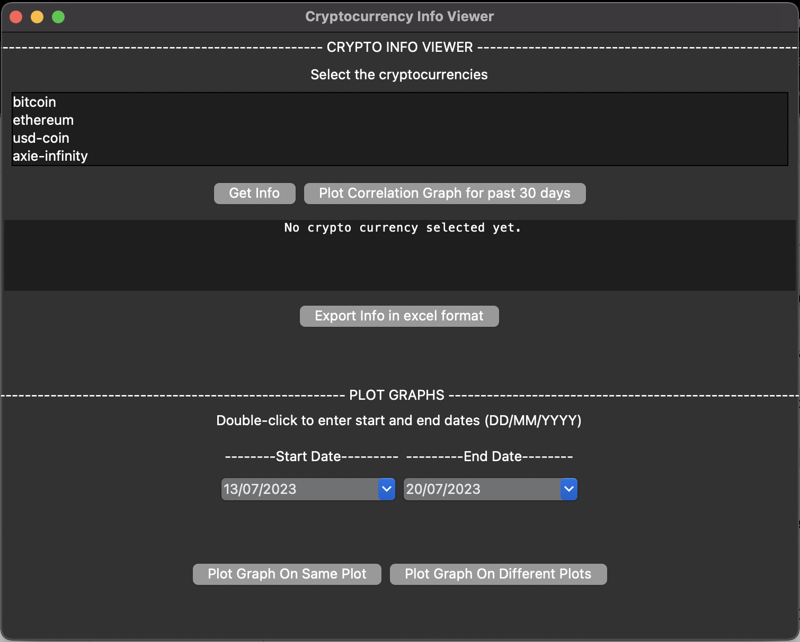
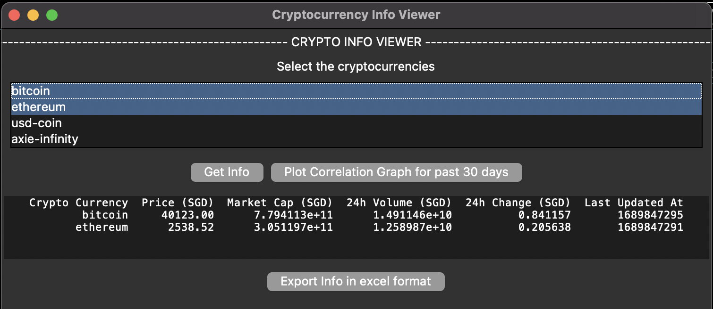
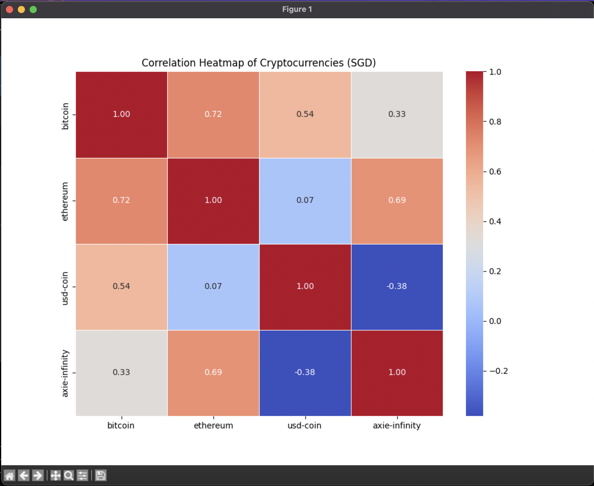
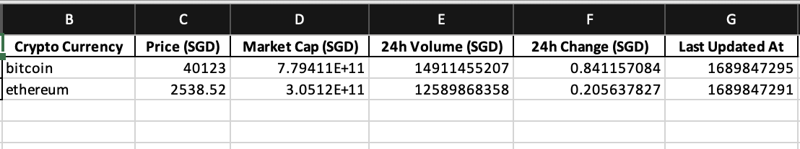
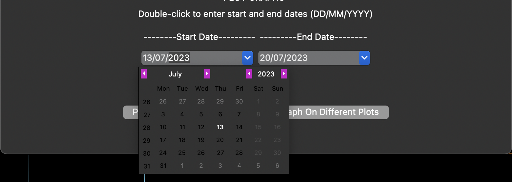
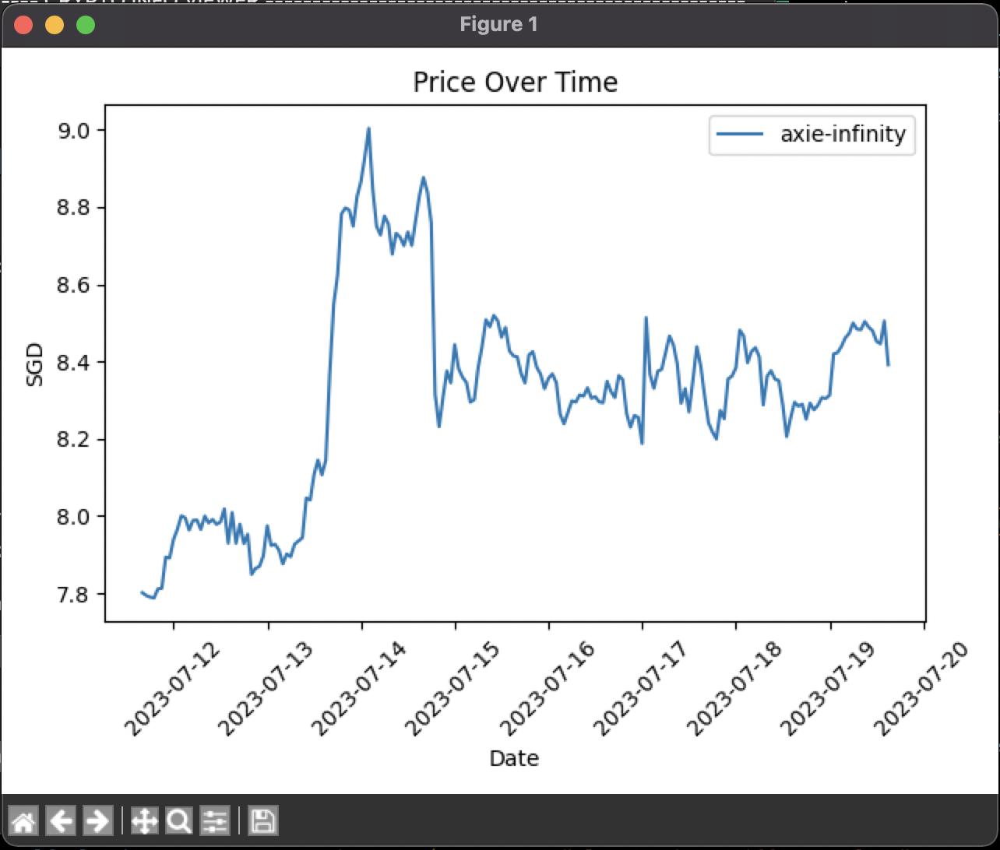
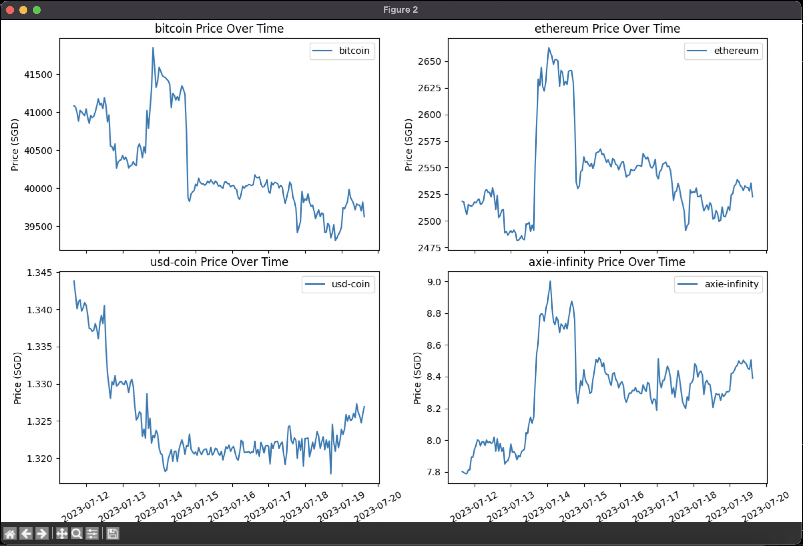

# Cryptocurrency Info Viewer

The Cryptocurrency Info Viewer is a simple GUI application built with Python and Tkinter that allows users to view information about selected cryptocurrencies, plot their price over time, and generate a correlation heatmap for selected cryptocurrencies.

Currently, the application focuses on 4 main cryptocurrencies (Bitcoin, Ethereum, USD coin and Axie Infinity).

## Features

- Select one or more cryptocurrencies from a list and click "Get Info" to display their price, market cap, 24-hour volume, 24-hour change, and last updated time in a tabular format using Pandas Dataframe and CoinGecko API.
- Ability to export the cryptocurrency information to an Excel file by clicking the "Export Info in Excel Format" button.
- Plot the price of selected cryptocurrencies over time on the same plot (subplots due to large differences in price range of the coins) by specifying start and end dates and clicking "Plot Graph On Same Plot".
- Plot the price of selected cryptocurrencies over time on different plots by specifying start and end dates and clicking "Plot Graph On Different Plots".
- Generate a correlation heatmap for the selected cryptocurrencies' prices over the past 30 days by clicking the "Plot Correlation Graph for past 30 days" button.

## How to Run the Application GUI

1. Download the source code or clone this repository

2. Create a virtual environment

```bash
python -m venv .venv
source .venv/bin/activate
```

3. Install required packages

```bash
pip install -r requirements.txt
```

4. Run the `crypto_info_viewer.py` script:

```bash
python main.py
```

5. This should be how the application looks like (on MacOS)


## Features Demo

1. Displaying information of selected cryptocurrencies


2. Correlation Heatmap with save image function on the bottom left


3. Export dataframe to excel file

* You should see a pop up if file was successfully exported


4. Graph Plotter (graphs can be exported and saved)


* Input your start and end dates using the datepickers provided

Individual Graphs

* Do note that if 2 or more cryptocurrencies were selected to be plot on different graphs, the figures will generate one-by-one.
* Hence, do save the figure (if needed) and close it to view the next graph.

Subplots 


## Disclaimer
This application uses data from the CoinGecko API to display cryptocurrency information and may be subject to limitations or restrictions from the API provider. Use it responsibly and in accordance with the terms of service of CoinGecko.